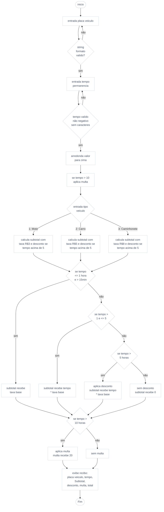

## Atividade Avaliativa – Laboratório de Programação
#### Engenharia da computação UFMA | Prof. Rondineli Seba Salomão

Este documento detalha o desenvolvimento de um protótipo funcional para um sistema de gerenciamento de estacionamento rotativo em linguagem C, como atividade avaliativa para aquisição de nota na disciplina de Laboratório de Programação ministrada pelo professor Rondineli Seba Salomão.
O objetivo central deste projeto é transpor a capacidade de modelar problemas reais, aplicando os conceitos requisitados e estruturando a lógica previamente a implementação. 
Ao longo deste relatório serão apresentadas as etapas de modelagem do problema, a definição técnica das variáveis utilizadas e a implementação do código, garantindo que as regras de negocio sejam sistematizadas de forma precisa.
Para que o software atenda às demandas de tráfego e cobrança, é fundamental mapear o ciclo de vida de um veículo dentro das instalações. Essa visão generalizada é apresentada a seguir com.


### Análise Primaria:

Um estacionamento rotativo funciona no formato de vagas compartilhadas por tempo limitado de uso, em áreas de alto fluxo como shoppings e edifícios comerciais, com taxação por tempo de uso e modalidade pos paga diferente de parquímetros com modalidade pre paga.
O veiculo se adentra as instalações através de uma cancela onde o veículo é registrado, identificado como uma das categorias de cobrança sendo moto, carros e caminhões. juntamente com horário de entrada e emitido um ticket para o futuro pagamento após o fim da estadia onde o cliente realiza o pagamento em um totem de autoatendimneto ou em um guichê onde o ticket é validado para saída que é realizada através de uma nova cancela aberta por meio do escaneamento do mesmo.

Um resumo das decisões tomadas pelo sistema são:
    
    • Identificação de usuário cliente;
    • Verificação do tempo de permanência;
    • Categorização do veículo;
    • Calculo da quantia a ser cobrada;
    • Elegibilidade para desconto;
    • Aplicação de multa;


### Definições

| Nome da Variavel | Tipo | Finalidade |
| :--- | :---: | :--- |
| `placaCarro` | char | Armazena a identificacao alfanumerica do veiculo (7 caracteres + terminador \0). |
| `tipoVeiculo` | char[] | Vetor de caracteres que recebe a descricao textual do tipo para o recibo. |
| `op` | int | operador para condicional switch, recebendo a opcao numerica do menu. |
| `tempoInt` | Int | Variavel auxiliar para arredondamento sem usar ciel() |
| `tempo`| float | Armazena o tempo de permanencia real utiliza float para permitir fracoes de hora. |
| `horaMoto`, `horaCarro`, `horacaminhonete` | float | Constantes de preco que definem o valor da tarifa por categoria. |
| `subtotal` | float | Armazena o valor base da estadia antes de beneficios ou penalidades. |
| `desconto` | float | Valor calculado (10%) para abatimento em estadias superiores a 5 horas. |
| `multa` | float | Valor fixo de R$ 20,00 aplicado a estadias que excedem 10 horas. |
| `inicio:`, `tempo:`, `tipo:` | rotulos | Rotulos utilizados como ancora para os saltos na estrutura. |
### Lógica Aplicada:

O modelo de negócio adotado prioriza a rotatividade das vagas por meio de uma curva de tarifação acentuada. Estabelece uma fração inicial maior para cobrir os custos operacionais e à medida que o tempo de permanência avança, o sistema aplica uma regra de desconto progressivo após 5 horas, visando incentivar o uso moderadamente prolongado. Contudo, para desencorajar o abandono do veículo, aplica-se uma multa fixa adicional mantendo o desconto promocional.

```
1 Solicita placa do veículo
	1.1 Valida formato da placa (7 caracteres alfanuméricos)
		1.1.1 Se inválida: Reinicia o processo (goto inicio)
2 Solicita tempo de permanência
	2.1 Valida se a entrada é numérica e positiva
		2.1.1 Se inválida: Solicita o tempo novamente (goto tempo)
3 Processa arredondamento de horas
	3.1 tempoInt recebe tempo através de cast
	3.2 Verifica se há fração de hora (tempo - tempoInt > 0)
		3.2.1 Se sim: arredonda tempo para cima
4 Apresenta menu seletor de categoria
5 Recebe categoria selecionada (op)
	5.1 Moto || Carro || Caminhonete
		5.1.1 Armazena descrição "Moto"
		5.1.2 Verifica regras de tempo:
			5.1.2.1 Tolerância 15 min atribuindo subtotal 0
			5.1.2.2 Entre 15 min e 1h aplica taxa mínima
			5.1.2.3 Entre 1h e 5h calcula subtotal tempoInt * taxa
			5.1.2.4 Acima de 5h calcula subtotal e armazena desconto
	5.2 Opção Inválida
		5.2.1 Exibe erro e reinicia o menu (goto tipo)
6 Verifica elegibilidade de multa
	6.1 Se tempo real > 10h aplica multa adicional
7 Calcula total (subtotal - desconto + multa)
8 Exibe Recibo Final detalhado
```


### Fluxograma


### Instalação / Compilação

O código apresentado utiliza linguagem C padrão, e pode ser executado em qualquer compilador como GCC ou utilizando IDEs como CodeBlocks, VS Code ou onlinegdb.com.


### Entradas e Saidas

```c
Digite a placa do veiculo (apenas letras e numeros): abc1234

insira o tempo de uso em horas: 10.5

1 - Moto 
2 - Carro 
3 – Caminhonete

Digite o tipo do veiculo:2

==========================================

Veiculo: abc1234 - Carro
Permanencia: 10.5 Horas
Subtotal: R$ 55.00
Descontos: R$ 5.50
Multa: R$ 20.00

------------------------------------------

Total: R$ 69.50

==========================================

```
Valores inseridos pelo usuário:
```
•  abc1234; placa do veiculo
•  10.5; tempo em horas decimais
•  2; tipo veiculo
```


### Autores
Matheus Silva Cunha - 2021052782 | 
[@MSCunha](https://www.github.com/MSCunha)
### Licença

[MIT](https://choosealicense.com/licenses/mit/)


